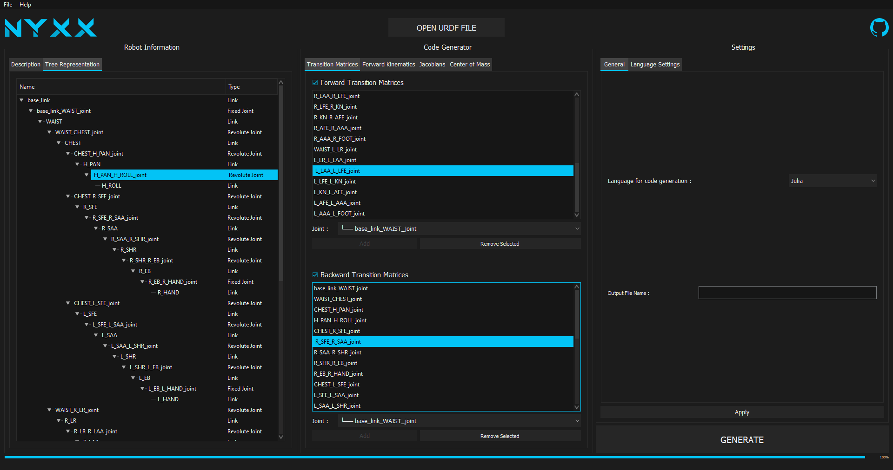

# NYXX User Manual

## Installation

### 1. Prerequisties : Python & Packages

*NYXX* is a Python program. You then need to have Python installed on your computer to run it. If you don't have Python yet, consider [installing it using Anaconda](https://www.anaconda.com/products/individual). Anaconda automatically installs a lot of amazing packages and some of them are needed to run this program. If you don't plan to start working with your own Python codes, a [classic installation](https://www.python.org/downloads/) is recommended as it will use less storage space. You will then need to install packages manually as shown below.

This project uses various packages that need to be installed to run the program correctly :

* [Numpy](https://numpy.org/) (installed with Anaconda)
* [Sympy](https://www.sympy.org) (installed with Anaconda)
* [Anytree](https://anytree.readthedocs.io) (**not** installed with Anaconda)
* [PyQt5](https://pypi.org/project/PyQt5/) (**not** installed with Anaconda)

If you don't have these installed, you can install them running :

```bash
pip install numpy
pip install sympy
pip install anytree
pip install PyQt5
```

The others parkages used in this project should have been installed with Python. However, if you encounter a `ModuleNotFoundError` when running NYXX, consider installing the missing package running :

```bash
pip install <packageName>
```

### 2. Download NYXX

First, clone this repository running in a shell :
```bash
git clone https://github.com/Teskann/NYXX
```
You can also download this repository as ZIP file if you don't have `git` installed on your computer.

### 3. Launch NYXX

Once you have got the files, you can launch the program running `nyxx.py` file :
```bash
python nyxx.py
```

## Main window

The main window of the program looks like this :



The window is divided in three parts :
* Robot Information
* Code Generator
* Settings

### Open a File

To open a file, simply click on the *OPEN URDF FILE* button at the top center or click on *File > Open* (`Ctrl + O`).

This should open a file dialog in the *Examples* directory. You can pick one of the files in here to try the software or open your own URDF file.

File openning can take a few seconds, especially if you have exotic joints transformations. This is normal and if your OS says NYXX is not responding, just wait, it shouldn't have crashed. The progress bar at the bottom will give you an idea of the remaining time.

### Robot Information (left)

This section contains the robot information. You can not edit content in this section.

The "*Description*" tab is a text area where you can see some details about your robot :
* Robot Name
* Number of Joints
* Number of Links
* Total Mass

The "*Tree Representation*" tab displays the tree representation of the robot. Take a look at it to check if it corresponds to the architecture your URDF file is supposed to describe. There shouldn't be bugs here, if the architecture is not correct, your URDF file is probably wrong.

### Code Generator (middle)

This section is the heart of the software. It is where you select what you want to generate. It is composed of 4 tabs.

#### Transition Matrices

This is where you select which transition matrices you want to generate. Transition matrices are expressed as 4x4 matrices in [homogeneous coordinates](https://en.wikipedia.org/wiki/Homogeneous_coordinates). They are associated with joints. If a joint `J` links two links `L1` and `L2`, the forward transition matrix associated to `J` is the expression of `L2` coordinates in the `L1`frame. The backward transition matrix associated to `J` is the expression of `L1` coordinates in the `L2`frame (this is actually the invert of the forward one). These matrices can depend on variables if `J` has degreees of freedom.

By default, when you open a file, all joints are preselected for generation, forward and backward. You can remove some of them if you don't need them clicking on *Remove Selected* (multiple selection is allowed). To add a joint, select it in the combo box and click *Add*. Note that you can't add a joint that is already in the list.

You have to check the checkboxes if you want the code to be generated.

#### Forward Kinematics

This where you select which [forward kinematics](https://en.wikipedia.org/wiki/Forward_kinematics) functions you want to generate. The forward kinematics are expressed as 4x4 matrices in [homogeneous coordinates](https://en.wikipedia.org/wiki/Homogeneous_coordinates).

Let's suppose a robot has the chain `L1 => J1 => L2 => ... => JN-1 => LN` where `Lk`are links and `Jk` are joints for all `k` in `{1, ... , N}`. The forward kinematics function having `L1` as origin and `LN` as destination will return the coordinates of `LN` in `L1` frame. The forward kinematics function having `LN` as origin and `L1` as destination will return the coordinates of `L1` in `LN` frame.

The code generated by this tool will call transition matrices functions associated with all the joints in the chain between the origin and destination. In the example above, the generated code will call transition matrices for `J1, ..., JN-1`. **Make sure to generate these functions in the *Transition Matrices* tab or the code will call functions that are not defined**.

By default, when you open a file, all the paths from the root link of the robot to all the leaf links of the robot are preselected for generation. You can remove them clicking on *Remove Selected* (multiple selection is allowed). To add a forward kinematics function, select an origin object in the *origin* combo box and a destination object in the *destination* combo box. Then, click *Add*. Note that you can't add a forward kinematics function that is already in the list.

#### Jacobians

This where you select which [Jacobian matrices](https://en.wikipedia.org/wiki/Jacobian_matrix_and_determinant) functions you want to generate. The jacobians are expressed as 6xN matrices where N is the number of degrees of freedom of the robot between the origin and the destination (terms defined below).

Let's suppose a robot has the chain `L1 => J1 => L2 => ... => JN-1 => LN` where `Lk`are links and `Jk` are joints with one degree of freedom for all `k` in `{1, ... , N}`. The jacobian function having `L1` as origin and `LN` as destination will return the derivative of the coordinates of `LN` in `L1` frame with respect to all the `N` degrees of freedom as follows :

```
/ dX              dX  \
| ---     ...     --- |
| dD1             dDN |
|                     |
| dY              dY  |
| ---     ...     --- |
| dD1             dDN |
|                     |
| dZ              dZ  |
| ---     ...     --- |
| dD1             dDN |
|                     |
| dR              dR  |
| ---     ...     --- |
| dD1             dDN |
|                     |
| dP              dP  |
| ---     ...     --- |
| dD1             dDN |
|                     |
| dy              dy  |
| ---     ...     --- |
\ dD1             dDN /
```

where :
* `d` represents the differentiation operator, 
* `X`, `Y` and `Z` are the cartesian coordinates of `LN` in the `L1` frame,
* `R`, `P` and `y` represent the roll, pitch and yaw of `LN` in the `L1` frame
* `Dk` represent the variable associated with the degree of freedom of the joint `k` for `k` in `{1, ... , N}`.

The code generated by this tool will call transition matrices functions associated with all the joints in the chain between the origin and destination. In the example above, the generated code will call transition matrices for `J1, ..., JN-1`. **Make sure to generate these functions in the *Transition Matrices* tab or the code will call functions that are not defined**.

By default, when you open a file, all the paths from the root link of the robot to all the leaf links of the robot are preselected for generation. You can remove them clicking on *Remove Selected* (multiple selection is allowed). To add a jacobian function, select an origin object in the *origin* combo box and a destination object in the *destination* combo box. Then, click *Add*. Note that you can't add a jacobian function that is already in the list.

#### Center of Mass

In this section, you will find two combo boxes to generate the center of mass function and its jacobian matrix.

The center of mass is expressed as a 4x1 matrix in [homogeneous coordinates](https://en.wikipedia.org/wiki/Homogeneous_coordinates). The first three coordinates represent the cartesian coordinates of the center of mass of the robot in the world frame, and the 4th coordinate is always equal to 1. There is no way to change the frame for the expression of the center of mass yet. To express it in another frame, multiply the forward kinematics function going from the world frame to the desired frame by the center of mass vector. If the robot mass is null, the code is not generated as the center of mass is not defined. You have to write explicitly the mass of each link in the URDF file (the default mass for URDF links is 0 kg).

The [Jacobian matrix](https://en.wikipedia.org/wiki/Jacobian_matrix_and_determinant) of the center of mass is expressed as a 3xN matrix where N is the number of degrees of freedom of the robot that have an impact on the center of mass position. Here is what the matrix looks like :

```
/ dX              dX  \
| ---     ...     --- |
| dD1             dDN |
|                     |
| dY              dY  |
| ---     ...     --- |
| dD1             dDN |
|                     |
| dZ              dZ  |
| ---     ...     --- |
\ dD1             dDN /
```

where :
* `d` represents the differentiation operator, 
* `X`, `Y` and `Z` are the cartesian coordinates of the center of mass in the world frame,
* `Dk` represent the variable associated with the degree of freedom of the joint `k` for `k` in `{1, ... , N}`.

Both the center of mass and the jacobian of the center of mass call transition matrices functions associated with all the joints having an impact on the center of mass position. **Make sure to generate these functions in the *Transition Matrices* tab or the code will call functions that are not defined**.

## Supported Files and Robot Types

This program only supports XML URDF formatted files. XACRO files are not supported. If you don't know what is the URDF format, take a look at the [official documentation](http://wiki.ros.org/urdf/XML).
Moreover, this program only supports **robots with a tree-like representation**. If you have loops in your physical architecture, it won't work because of infinite loops. This kind of robots may never be supported by this software as the tree representation is fundamental in the NYXX algorithms.

Try to avoid commented lines `<!--...-->` in your URDF file, as some parsing errors have been detected with this, for some reason. This should be patched in a future version. If you can't parse the file althrough it should be correct, try to keep only `<link>` and `<joint>` elements (they are the only one used by NYXX). If the parser keeps failing, consider reporting the bug.

If you open a not-supported file, it will throw an error and this can lead to the program dies, depending on your operating system (errors are not handeled in the GUI yet).

## Generated Code

The generated files are stored in the `generated` directory.

All the generated functions come with their docstring explaining how to use them correctly.

### Python

The Python generated code uses [Numpy](https://numpy.org/) package to work with matrix computations. Consider installing it on the device on which you want to implement your controller running :
```bash
pip install numpy
```
The other functions like `cos` or `sin` are imported from `math` package, which is built-in.

Here is an example of what the generated code looks like running on `example_0.urdf` with the default settings :

```python
"""

The  code  in  file  has  been  generated by NYXX Code Generator on 07/24/2020,
12:45:16. Consider testing this code before using it as errors remain possible.
For  more  details,  check  out  the  github  repository  of  this  projets  at
https://github.com/Teskann/NYXX.

"""

from math import cos, sin
from numpy import array, cross, dot, zeros, eye

# -----------------------------------------------------------------------------
# |                        FORWARD TRANSISION MATRICES                        |
# -----------------------------------------------------------------------------

# Joint 0 _____________________________________________________________________

def T_joint1(theta_joint1):
    """
    Description
    -----------
    
    Transition Matrix to go from link link1 to link link2.
    This joint is continuous. The matrix is :
    
    [1          0                  0           0]
    [                                           ]
    [0  cos(theta_joint1)  -sin(theta_joint1)  0]
    [                                           ]
    [0  sin(theta_joint1)  cos(theta_joint1)   0]
    [                                           ]
    [0          0                  0           1]
    
    Parameters
    ----------
    
    theta_joint1 : float
        Rotation value (in radians) around the joint1 joint axis.
    
    """

    # Returned Matrix
    mat = array([[1,0,0,0],
          [0,cos(theta_joint1),-sin(theta_joint1),0],
          [0,sin(theta_joint1),cos(theta_joint1),0],
          [0,0,0,1]])

    return mat


# Joint 1 _____________________________________________________________________

def T_joint2(theta_joint2):
    """
    Description
    -----------
    
    Transition Matrix to go from link link1 to link link3.
    This joint is continuous. The matrix is :
    
    [1          0                  0           0]
    [                                           ]
    [0  cos(theta_joint2)  -sin(theta_joint2)  0]
    [                                           ]
    [0  sin(theta_joint2)  cos(theta_joint2)   0]
    [                                           ]
    [0          0                  0           1]
    
    Parameters
    ----------
    
    theta_joint2 : float
        Rotation value (in radians) around the joint2 joint axis.
    
    """

    # Returned Matrix
    mat = array([[1,0,0,0],
          [0,cos(theta_joint2),-sin(theta_joint2),0],
          [0,sin(theta_joint2),cos(theta_joint2),0],
          [0,0,0,1]])

    return mat


# Joint 2 _____________________________________________________________________

def T_joint3(theta_joint3):
    """
    Description
    -----------
    
    Transition Matrix to go from link link3 to link link4.
    This joint is continuous. The matrix is :
    
    [1          0                  0           0]
    [                                           ]
    [0  cos(theta_joint3)  -sin(theta_joint3)  0]
    [                                           ]
    [0  sin(theta_joint3)  cos(theta_joint3)   0]
    [                                           ]
    [0          0                  0           1]
    
    Parameters
    ----------
    
    theta_joint3 : float
        Rotation value (in radians) around the joint3 joint axis.
    
    """

    # Returned Matrix
    mat = array([[1,0,0,0],
          [0,cos(theta_joint3),-sin(theta_joint3),0],
          [0,sin(theta_joint3),cos(theta_joint3),0],
          [0,0,0,1]])

    return mat


# -----------------------------------------------------------------------------
# |                       BACKWARD TRANSISION MATRICES                        |
# -----------------------------------------------------------------------------

# Joint 0 Inverse _____________________________________________________________

def T_joint1_inv(theta_joint1):
    """
    Description
    -----------
    
    Transition Matrix to go from link link2 to link link1.
    This joint is continuous. The matrix is :
    
    [1          0                   0          0]
    [                                           ]
    [0  cos(theta_joint1)   sin(theta_joint1)  0]
    [                                           ]
    [0  -sin(theta_joint1)  cos(theta_joint1)  0]
    [                                           ]
    [0          0                   0          1]
    
    
    Parameters
    ----------
    
    theta_joint1 : float
        Rotation value (in radians) around the joint1 joint axis.
    
    """

    # Returned Matrix
    mat = array([[1,0,0,0],
          [0,cos(theta_joint1),sin(theta_joint1),0],
          [0,-sin(theta_joint1),cos(theta_joint1),0],
          [0,0,0,1]])

    return mat


# Joint 1 Inverse _____________________________________________________________

def T_joint2_inv(theta_joint2):
    """
    Description
    -----------
    
    Transition Matrix to go from link link3 to link link1.
    This joint is continuous. The matrix is :
    
    [1          0                   0          0]
    [                                           ]
    [0  cos(theta_joint2)   sin(theta_joint2)  0]
    [                                           ]
    [0  -sin(theta_joint2)  cos(theta_joint2)  0]
    [                                           ]
    [0          0                   0          1]
    
    
    Parameters
    ----------
    
    theta_joint2 : float
        Rotation value (in radians) around the joint2 joint axis.
    
    """

    # Returned Matrix
    mat = array([[1,0,0,0],
          [0,cos(theta_joint2),sin(theta_joint2),0],
          [0,-sin(theta_joint2),cos(theta_joint2),0],
          [0,0,0,1]])

    return mat


# Joint 2 Inverse _____________________________________________________________

def T_joint3_inv(theta_joint3):
    """
    Description
    -----------
    
    Transition Matrix to go from link link4 to link link3.
    This joint is continuous. The matrix is :
    
    [1          0                   0          0]
    [                                           ]
    [0  cos(theta_joint3)   sin(theta_joint3)  0]
    [                                           ]
    [0  -sin(theta_joint3)  cos(theta_joint3)  0]
    [                                           ]
    [0          0                   0          1]
    
    
    Parameters
    ----------
    
    theta_joint3 : float
        Rotation value (in radians) around the joint3 joint axis.
    
    """

    # Returned Matrix
    mat = array([[1,0,0,0],
          [0,cos(theta_joint3),sin(theta_joint3),0],
          [0,-sin(theta_joint3),cos(theta_joint3),0],
          [0,0,0,1]])

    return mat


# -----------------------------------------------------------------------------
# |                            FORWARD KINEMATICS                             |
# -----------------------------------------------------------------------------

# Forward Kinematics from link_0 to link_1 ____________________________________

def fk_link1_link2(q):
    """
    Description
    -----------
    
    Comuputes the forward kinematics from the link link1 to the link link2. The
    result is returned as a 4x4 numpy.ndarray in homogeneous coordinates.
    
    Parameters
    ----------
    
    q : numpy.ndarray
        Vector of variables where :
            - q[0] = theta_joint1 :
                  Rotation value (in radians) around the joint1 joint axis.
    
    """

    T_0 = T_joint1(q[0])
    
    return T_0


# Forward Kinematics from link_0 to link_3 ____________________________________

def fk_link1_link4(q):
    """
    Description
    -----------
    
    Comuputes the forward kinematics from the link link1 to the link link4. The
    result is returned as a 4x4 numpy.ndarray in homogeneous coordinates.
    
    Parameters
    ----------
    
    q : numpy.ndarray
        Vector of variables where :
            - q[0] = theta_joint2 :
                  Rotation value (in radians) around the joint2 joint axis.
            - q[1] = theta_joint3 :
                  Rotation value (in radians) around the joint3 joint axis.
    
    """

    T_1 = T_joint2(q[0])
    T_2 = T_joint3(q[1])
    
    return dot(T_1,T_2)


# -----------------------------------------------------------------------------
# |                                 JACOBIANS                                 |
# -----------------------------------------------------------------------------

# Jacobian of the link_1 position and orientation _____________________________

def jacobian_link1_to_link2(p0, q):
    """
    Description
    -----------
    
    Computes  the  Jacobian  Matrix of the link2 coordinates in the link1 frame
    from  the point p0. This matrix is returned as a (6 x 1) matrix where every
    column  is  the  derivative  of  the position/orientation with respect to a
    degree of freedom.
          -  The  line  1 is the derivative of X position of link2 in the link1
          frame,
          -  The  line  2 is the derivative of Y position of link2 in the link1
          frame,
          -  The  line  3 is the derivative of Z position of link2 in the link1
          frame,
          -  The  line  4 is the derivative of the roll orientation of link2 in
          the link1 frame,
          -  The  line 5 is the derivative of the pitch orientation of link2 in
          the link1 frame,
          - The line 6 is the derivative of the yaw orientation of link2 in the
          link1 frame,
    Here is the list of all the derivative variables :
        - Column 0 : theta_joint1
    
    Parameters
    ----------
    
    p0 : numpy.ndarray
        Point in the link1 frame where you want to compute the Jacobian Matrix.
        p0 is a (3 x 1) vector.
    
    q : numpy.ndarray
        Vector  of  length 1 containing all the degrees of freedom of the robot
        between link1 and link2 chain. This vector contains :
            - q[0] = theta_joint1 :
                  Rotation value (in radians) around the joint1 joint axis.
    
    """

    Jac = zeros((6, 1))
    T = T_joint1(q[0])
    L = p0-T[0:3,3]
    Z = T[0:3,2]
    Jac[0:3,0] = cross(Z,L)
    Jac[3:6,0] = Z
    
    return Jac


# Jacobian of the link_3 position and orientation _____________________________

def jacobian_link1_to_link4(p0, q):
    """
    Description
    -----------
    
    Computes  the  Jacobian  Matrix of the link4 coordinates in the link1 frame
    from  the point p0. This matrix is returned as a (6 x 2) matrix where every
    column  is  the  derivative  of  the position/orientation with respect to a
    degree of freedom.
          -  The  line  1 is the derivative of X position of link4 in the link1
          frame,
          -  The  line  2 is the derivative of Y position of link4 in the link1
          frame,
          -  The  line  3 is the derivative of Z position of link4 in the link1
          frame,
          -  The  line  4 is the derivative of the roll orientation of link4 in
          the link1 frame,
          -  The  line 5 is the derivative of the pitch orientation of link4 in
          the link1 frame,
          - The line 6 is the derivative of the yaw orientation of link4 in the
          link1 frame,
    Here is the list of all the derivative variables :
        - Column 0 : theta_joint2
        - Column 1 : theta_joint3
    
    Parameters
    ----------
    
    p0 : numpy.ndarray
        Point in the link1 frame where you want to compute the Jacobian Matrix.
        p0 is a (3 x 1) vector.
    
    q : numpy.ndarray
        Vector  of  length 2 containing all the degrees of freedom of the robot
        between link1 and link4 chain. This vector contains :
            - q[0] = theta_joint2 :
                  Rotation value (in radians) around the joint2 joint axis.
            - q[1] = theta_joint3 :
                  Rotation value (in radians) around the joint3 joint axis.
    
    """

    Jac = zeros((6, 2))
    T = T_joint2(q[0])
    L = p0-T[0:3,3]
    Z = T[0:3,2]
    Jac[0:3,0] = cross(Z,L)
    Jac[3:6,0] = Z
    T = dot(T,T_joint3(q[1]))
    L = p0-T[0:3,3]
    Z = T[0:3,2]
    Jac[0:3,1] = cross(Z,L)
    Jac[3:6,1] = Z
    
    return Jac


# Center of mass function can not be generated because the robot mass is null.

# Center of mass jacobian function can not be generated because the robot mass is null.
```

### Julia

The Julia generated code uses the [LinearAlgebra](https://docs.julialang.org/en/v1/stdlib/LinearAlgebra/) module to work with matrix computations. This package should be installed with Julia.

Here is an example of what the generated code looks like running on `example_0.urdf` with the default settings :
```julia
"""

The code in file has been generated by NYXX Code Generator on 07/24/2020, 12:41:38. Consider
testing this code before using it as errors remain possible. For more details, check out the
github repository of this projets at https://github.com/Teskann/NYXX.

"""

using LinearAlgebra

# ------------------------------------------------------------------------------------------
# |                              FORWARD TRANSISION MATRICES                               |
# ------------------------------------------------------------------------------------------

# Joint 0 __________________________________________________________________________________

"""
    T_joint1(theta_joint1)

Description
-----------

Transition Matrix to go from link link1 to link link2.
This joint is continuous. The matrix is :

[1          0                  0           0]
[                                           ]
[0  cos(theta_joint1)  -sin(theta_joint1)  0]
[                                           ]
[0  sin(theta_joint1)  cos(theta_joint1)   0]
[                                           ]
[0          0                  0           1]

Parameters
----------

theta_joint1 : Float64
    Rotation value (in radians) around the joint1 joint axis.

"""
function T_joint1(theta_joint1)
    
    # Returned Matrix
    mat = [1 0 0 0;
          0 cos(theta_joint1) -sin(theta_joint1) 0;
          0 sin(theta_joint1) cos(theta_joint1) 0;
          0 0 0 1]

    return mat
end

# Joint 1 __________________________________________________________________________________

"""
    T_joint2(theta_joint2)

Description
-----------

Transition Matrix to go from link link1 to link link3.
This joint is continuous. The matrix is :

[1          0                  0           0]
[                                           ]
[0  cos(theta_joint2)  -sin(theta_joint2)  0]
[                                           ]
[0  sin(theta_joint2)  cos(theta_joint2)   0]
[                                           ]
[0          0                  0           1]

Parameters
----------

theta_joint2 : Float64
    Rotation value (in radians) around the joint2 joint axis.

"""
function T_joint2(theta_joint2)
    
    # Returned Matrix
    mat = [1 0 0 0;
          0 cos(theta_joint2) -sin(theta_joint2) 0;
          0 sin(theta_joint2) cos(theta_joint2) 0;
          0 0 0 1]

    return mat
end

# Joint 2 __________________________________________________________________________________

"""
    T_joint3(theta_joint3)

Description
-----------

Transition Matrix to go from link link3 to link link4.
This joint is continuous. The matrix is :

[1          0                  0           0]
[                                           ]
[0  cos(theta_joint3)  -sin(theta_joint3)  0]
[                                           ]
[0  sin(theta_joint3)  cos(theta_joint3)   0]
[                                           ]
[0          0                  0           1]

Parameters
----------

theta_joint3 : Float64
    Rotation value (in radians) around the joint3 joint axis.

"""
function T_joint3(theta_joint3)
    
    # Returned Matrix
    mat = [1 0 0 0;
          0 cos(theta_joint3) -sin(theta_joint3) 0;
          0 sin(theta_joint3) cos(theta_joint3) 0;
          0 0 0 1]

    return mat
end

# ------------------------------------------------------------------------------------------
# |                              BACKWARD TRANSISION MATRICES                              |
# ------------------------------------------------------------------------------------------

# Joint 0 Inverse __________________________________________________________________________

"""
    T_joint1_inv(theta_joint1)

Description
-----------

Transition Matrix to go from link link2 to link link1.
This joint is continuous. The matrix is :

[1          0                   0          0]
[                                           ]
[0  cos(theta_joint1)   sin(theta_joint1)  0]
[                                           ]
[0  -sin(theta_joint1)  cos(theta_joint1)  0]
[                                           ]
[0          0                   0          1]


Parameters
----------

theta_joint1 : Float64
    Rotation value (in radians) around the joint1 joint axis.

"""
function T_joint1_inv(theta_joint1)
    
    # Returned Matrix
    mat = [1 0 0 0;
          0 cos(theta_joint1) sin(theta_joint1) 0;
          0 -sin(theta_joint1) cos(theta_joint1) 0;
          0 0 0 1]

    return mat
end

# Joint 1 Inverse __________________________________________________________________________

"""
    T_joint2_inv(theta_joint2)

Description
-----------

Transition Matrix to go from link link3 to link link1.
This joint is continuous. The matrix is :

[1          0                   0          0]
[                                           ]
[0  cos(theta_joint2)   sin(theta_joint2)  0]
[                                           ]
[0  -sin(theta_joint2)  cos(theta_joint2)  0]
[                                           ]
[0          0                   0          1]


Parameters
----------

theta_joint2 : Float64
    Rotation value (in radians) around the joint2 joint axis.

"""
function T_joint2_inv(theta_joint2)
    
    # Returned Matrix
    mat = [1 0 0 0;
          0 cos(theta_joint2) sin(theta_joint2) 0;
          0 -sin(theta_joint2) cos(theta_joint2) 0;
          0 0 0 1]

    return mat
end

# Joint 2 Inverse __________________________________________________________________________

"""
    T_joint3_inv(theta_joint3)

Description
-----------

Transition Matrix to go from link link4 to link link3.
This joint is continuous. The matrix is :

[1          0                   0          0]
[                                           ]
[0  cos(theta_joint3)   sin(theta_joint3)  0]
[                                           ]
[0  -sin(theta_joint3)  cos(theta_joint3)  0]
[                                           ]
[0          0                   0          1]


Parameters
----------

theta_joint3 : Float64
    Rotation value (in radians) around the joint3 joint axis.

"""
function T_joint3_inv(theta_joint3)
    
    # Returned Matrix
    mat = [1 0 0 0;
          0 cos(theta_joint3) sin(theta_joint3) 0;
          0 -sin(theta_joint3) cos(theta_joint3) 0;
          0 0 0 1]

    return mat
end

# ------------------------------------------------------------------------------------------
# |                                   FORWARD KINEMATICS                                   |
# ------------------------------------------------------------------------------------------

# Forward Kinematics from link_0 to link_1 _________________________________________________

"""
    fk_link1_link2(q)

Description
-----------

Comuputes  the  forward  kinematics  from  the  link  link1 to the link link2. The result is
returned as a 4x4 Matrix in homogeneous coordinates.

Parameters
----------

q : Vector
    Vector of variables where :
        - q[1] = theta_joint1 :
              Rotation value (in radians) around the joint1 joint axis.

"""
function fk_link1_link2(q)
    
    T_0 = T_joint1(q[1])
    
    return T_0
end

# Forward Kinematics from link_0 to link_3 _________________________________________________

"""
    fk_link1_link4(q)

Description
-----------

Comuputes  the  forward  kinematics  from  the  link  link1 to the link link4. The result is
returned as a 4x4 Matrix in homogeneous coordinates.

Parameters
----------

q : Vector
    Vector of variables where :
        - q[1] = theta_joint2 :
              Rotation value (in radians) around the joint2 joint axis.
        - q[2] = theta_joint3 :
              Rotation value (in radians) around the joint3 joint axis.

"""
function fk_link1_link4(q)
    
    T_1 = T_joint2(q[1])
    T_2 = T_joint3(q[2])
    
    return T_1*T_2
end

# ------------------------------------------------------------------------------------------
# |                                       JACOBIANS                                        |
# ------------------------------------------------------------------------------------------

# Jacobian of the link_1 position and orientation __________________________________________

"""
    jacobian_link1_to_link2(p0, q)

Description
-----------

Computes  the Jacobian Matrix of the link2 coordinates in the link1 frame from the point p0.
This  matrix  is  returned  as  a (6 x 1) matrix where every column is the derivative of the
position/orientation with respect to a degree of freedom.
    - The line 1 is the derivative of X position of link2 in the link1 frame,
    - The line 2 is the derivative of Y position of link2 in the link1 frame,
    - The line 3 is the derivative of Z position of link2 in the link1 frame,
    - The line 4 is the derivative of the roll orientation of link2 in the link1 frame,
    - The line 5 is the derivative of the pitch orientation of link2 in the link1 frame,
    - The line 6 is the derivative of the yaw orientation of link2 in the link1 frame,
Here is the list of all the derivative variables :
    - Column 1 : theta_joint1

Parameters
----------

p0 : Vector
    Point  in the link1 frame where you want to compute the Jacobian Matrix. p0 is a (3 x 1)
    vector.

q : Vector
    Vector  of length 1 containing all the degrees of freedom of the robot between link1 and
    link2 chain. This vector contains :
        - q[1] = theta_joint1 :
              Rotation value (in radians) around the joint1 joint axis.

"""
function jacobian_link1_to_link2(p0, q)
    
    Jac = zeros(6, 1)
    T = T_joint1(q[1])
    L = p0-T[1:3,4]
    Z = T[1:3,3]
    Jac[1:3,1] = cross(Z,L)
    Jac[4:6,1] = Z
    
    return Jac
end

# Jacobian of the link_3 position and orientation __________________________________________

"""
    jacobian_link1_to_link4(p0, q)

Description
-----------

Computes  the Jacobian Matrix of the link4 coordinates in the link1 frame from the point p0.
This  matrix  is  returned  as  a (6 x 2) matrix where every column is the derivative of the
position/orientation with respect to a degree of freedom.
    - The line 1 is the derivative of X position of link4 in the link1 frame,
    - The line 2 is the derivative of Y position of link4 in the link1 frame,
    - The line 3 is the derivative of Z position of link4 in the link1 frame,
    - The line 4 is the derivative of the roll orientation of link4 in the link1 frame,
    - The line 5 is the derivative of the pitch orientation of link4 in the link1 frame,
    - The line 6 is the derivative of the yaw orientation of link4 in the link1 frame,
Here is the list of all the derivative variables :
    - Column 1 : theta_joint2
    - Column 2 : theta_joint3

Parameters
----------

p0 : Vector
    Point  in the link1 frame where you want to compute the Jacobian Matrix. p0 is a (3 x 1)
    vector.

q : Vector
    Vector  of length 2 containing all the degrees of freedom of the robot between link1 and
    link4 chain. This vector contains :
        - q[1] = theta_joint2 :
              Rotation value (in radians) around the joint2 joint axis.
        - q[2] = theta_joint3 :
              Rotation value (in radians) around the joint3 joint axis.

"""
function jacobian_link1_to_link4(p0, q)
    
    Jac = zeros(6, 2)
    T = T_joint2(q[1])
    L = p0-T[1:3,4]
    Z = T[1:3,3]
    Jac[1:3,1] = cross(Z,L)
    Jac[4:6,1] = Z
    T = T*T_joint3(q[2])
    L = p0-T[1:3,4]
    Z = T[1:3,3]
    Jac[1:3,2] = cross(Z,L)
    Jac[4:6,2] = Z
    
    return Jac
end

# Center of mass function can not be generated because the robot mass is null.

# Center of mass jacobian function can not be generated because the robot mass is null.

```