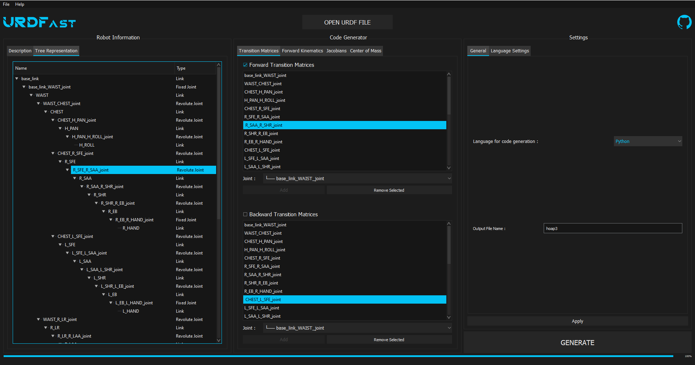

# URDFast - Generate Code From URDF

## Description
*URDFast* is a Python program to generate code from [URDF XML files](http://wiki.ros.org/urdf/XML) to implement a controller for your favorite robot. It comes with a catchy GUI to make its use easier.
This tool features code genetation for :

* Forward transition matrices
* Backward transition matrices
* Forward Kinematics
* Jacobian Matrices (6 x n)
* Center of Mass
* Jacobian of the center of mass (3 x n)

The supported languages for code generation are currently :

* Python
* Julia

More languages and features will be added in future versions, make sure to check this repository frequently so you don't miss any update !



## Getting Started
### 1. Needed Packages
This project uses various packages that need to be installed to run the program correctly :

* [Numpy](https://numpy.org/)
* [Sympy](https://www.sympy.org)
* [Anytree](https://anytree.readthedocs.io)
* [PyQt5](https://pypi.org/project/PyQt5/)

If you don't have these installed, you can install them running :

```bash
pip install numpy
pip install sympy
pip install anytree
pip install PyQt5
```

The others parkages used in this project should have been installed with Python. However, if you encounter a `ModuleNotFoundError` when running URDFast, consider installing the missing package running :

```bash
pip install <packageName>
```

### 2. Download URDFast

First, clone this repository running :
```bash
git clone https://github.com/Teskann/URDFast
```
You can also download this repository as ZIP file if you don't have git installed on your computer.

### 3. Launch URDFast

Once you have got the files, you can launch the program running `urdfast.py` file :
```bash
cd ./URDFast
python urdfast.py
```

URDFast has been developped using **Windows 10** but as Python and PyQt5 are cross-platform, it should work on **Mac OS** and **Linux** distributions as well.

### 4. Learn how to use it !

The software use is pretty straight-forward, but you should take a look at the [user manual](./documentation/usermanual.md) to prevent any problems.

### 5. Contribute ?

If you like the project and you are a Python developper and/or fan of robotics, don't hesitate to contribute to it ! Check out the [documentation for developpement](./documentation/devdoc.md). Each function comes with its documentation so you can get into the project faster.

Amazing features such as robot dynamics, torque control, control loops, C++ support are not supported yet, your help for this is welcome !

## Context & References

### Context

I am an engineer student at Polytech Montpellier, France in Microelectronics & Automation.
This project has been developped during my summer internship at the [LIRMM](http://www.lirmm.fr/lirmm_eng) (Laboratory of Computer Science, Robotics and Microelectronics of Montpellier) under the supervision of Philippe Fraisse and André Crosnier.

Of course, I intend to maintain this project and add new features to it in the future, even if my internship is over.

### References

This project has been inspired by the work of some other people :

* The URDF parser `URDF.py` has been taken from a project carried out by some of my classmates working on a humanoid robot called *Poppy*. You can check out their amazing work on [their GitLab repository](https://gitlab.polytech.umontpellier.fr/docs/poppy).
The authors are : Mathieu Célérier, Maxime Cognié, Hypolite Le Nabat, Enzo Rosarini and Nicolas Troesch.

* The Dark Theme for the QT UI has been inspired by the work of [Alexhuszagh](https://github.com/Alexhuszagh) on [BreezeStyleSheets](https://github.com/Alexhuszagh/BreezeStyleSheets). This project provides a dark theme QSS file that has been used and modified to design the URDFast theme.